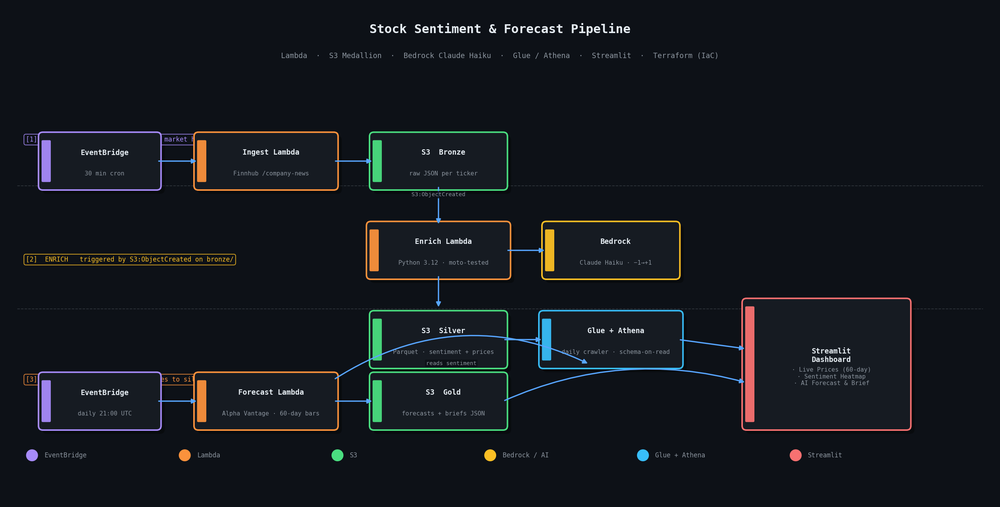
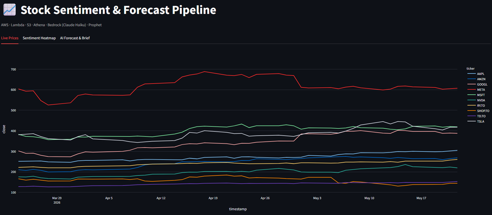
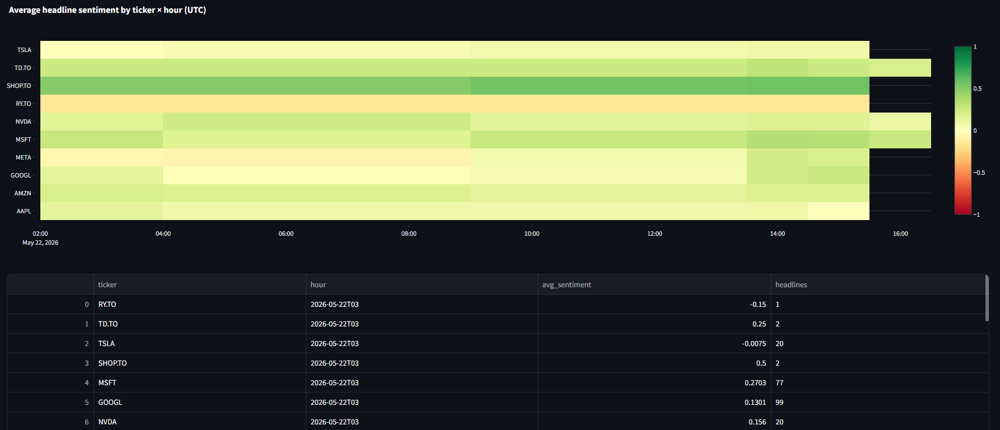
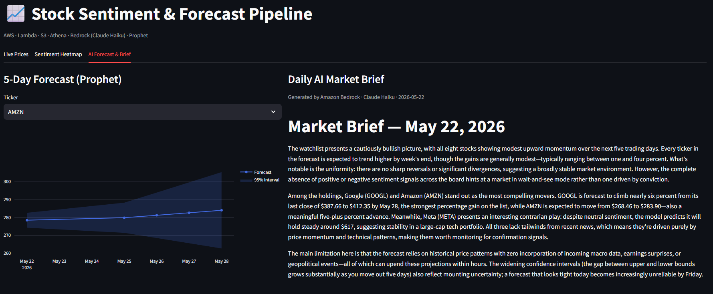

# Stock Sentiment & Forecast Pipeline

End-to-end AWS data pipeline that **ingests live financial news, scores each headline with a Bedrock-hosted LLM, joins the sentiment to daily price data, projects a 5-day forecast, and serves everything through an interactive Streamlit dashboard.** Fully provisioned with Terraform and engineered to stay inside the AWS Free Tier.

> Portfolio project. Built to demonstrate end-to-end data engineering judgment — from API selection under cost constraints, through IAM debugging, to dashboard delivery.

---

## Table of contents

- [Architecture](#architecture)
- [Engineering decisions worth knowing about](#engineering-decisions-worth-knowing-about)
- [What the code demonstrates](#what-the-code-demonstrates)
- [Dashboard](#dashboard)
- [Cost](#cost)
- [Running it yourself](#running-it-yourself)
- [Limitations & roadmap](#limitations--roadmap)

---

## Architecture



> Generated by [`docs/gen_architecture.py`](docs/gen_architecture.py) — re-run anytime with `py docs/gen_architecture.py`.

The pipeline follows the **medallion / lakehouse** pattern: raw JSON in bronze, conformed Parquet in silver, analytics-ready aggregates in gold. Athena reads silver and gold via the Glue Data Catalog — schema-on-read, no separate warehouse.

---

## Engineering decisions worth knowing about

Most data-pipeline tutorials gloss over the real problems. Below are the four non-obvious ones I hit building this — they're where most of the engineering work actually went.

### 1. Why no `yfinance`?

Yahoo Finance blocks AWS public IP ranges. From a Lambda, `yf.download()` either times out or returns an empty DataFrame depending on the day — and Yahoo's anti-bot defenses change frequently enough that pinning a `yfinance` version doesn't help. Almost every public tutorial uses yfinance and almost none of them deploy to AWS, so this gap isn't documented.

**Resolution:** swap to two purpose-fit providers (see #2).

### 2. Why two API providers (Finnhub + Alpha Vantage)?

Finnhub's free tier turned out to be effectively news-only:
- `/company-news` — works on free tier, generous quota
- `/quote` — returns 200 OK with all zeros (`{"c":0,"t":0,...}`) — a silent failure mode I had to discover by inspecting the bronze JSON
- `/stock/candle` — premium-only as of mid-2024

Alpha Vantage's free tier complements this exactly:
- `TIME_SERIES_DAILY` — works on free tier
- Daily rate limit: 25 requests, ~1 req/sec
- Covers both NYSE and TSX (`SHOP.TRT` for Shopify, etc.)

So the pipeline uses **Finnhub for news (high frequency, 30-min cadence)** and **Alpha Vantage for daily prices (low frequency, once-a-day forecast)**. 10 tickers × 1 daily call = 10 requests/day, well within the 25-req limit. The 1-req/sec cap is handled by `time.sleep(1.2)` between calls in the forecast loop.

### 3. The Athena IAM gotcha that cost an hour

Athena's `StartQueryExecution` requires `s3:GetBucketLocation` on the output bucket — a permission separate from `s3:PutObject`. Without it, every query fails with the misleading error:

> `Unable to verify/create output bucket stock-sentiment-athena-XXXXXX`

…which suggests the bucket doesn't exist. The bucket exists. The Lambda just can't tell Athena to verify the bucket's region. Same applies to `s3:ListBucketMultipartUploads` and `s3:ListMultipartUploadParts` for larger result sets. All four are now in the inline policy: [`infra/iam.tf:24-35`](infra/iam.tf).

### 4. Graceful degradation under rate limits

The forecast Lambda's error handling matters more than the happy path. If Alpha Vantage rate-limits one ticker, the loop logs the API's verbatim message and continues with the next ticker rather than aborting. If the Athena sentiment join fails (e.g. crawler hasn't run yet, table doesn't exist), `_get_sentiment` returns an empty DataFrame and the model defaults to `sentiment=0.0` — the forecast still runs, just without sentiment as a regressor.

This means **the worst-case run still produces output** rather than the binary success-or-failure pattern that breaks dashboards.

---

## What the code demonstrates

| Capability | Where in the repo |
|---|---|
| AWS Lambda (Python 3.12, no Docker) | [`lambdas/{ingest,enrich,forecast}/handler.py`](lambdas/) |
| Event-driven architecture | EventBridge cron + S3 → Lambda trigger — [`infra/eventbridge.tf`](infra/eventbridge.tf), [`infra/s3.tf`](infra/s3.tf) |
| Medallion lakehouse | S3 `bronze/` raw JSON → `silver/` Parquet → `gold/` analytics |
| Glue + Athena | [`infra/glue.tf`](infra/glue.tf) — schema-on-read with the crawler creating per-prefix tables |
| Bedrock / GenAI | Claude Haiku scores each headline (`-1` bearish ↔ `+1` bullish) and writes a daily 3-paragraph market brief — [`lambdas/enrich/handler.py`](lambdas/enrich/handler.py), [`lambdas/forecast/handler.py`](lambdas/forecast/handler.py) |
| Time-series forecasting | Exponentially-weighted linear regression on 60 daily closes, with average 7-day sentiment as a slope multiplier |
| Infrastructure as Code | Terraform — IAM, S3, Lambda, EventBridge, Glue, Athena |
| CI | GitHub Actions runs pytest + `terraform validate` — [`.github/workflows/deploy.yml`](.github/workflows/deploy.yml) |
| Tests | `pytest` + `moto` mocked S3 + Bedrock — [`tests/`](tests/) |
| Dashboard | Streamlit + Plotly, 3 interactive tabs — [`dashboard/`](dashboard/) |

---

## Dashboard

Run locally with Streamlit (see [Running it yourself](#running-it-yourself)). Three tabs backed by Athena + direct S3 reads:

1. **Live Prices** — Plotly line chart of close prices for all watchlist tickers, last 60 days
2. **Sentiment Heatmap** — ticker × hour grid, red (bearish) → green (bullish), generated from the LLM scores
3. **AI Forecast & Brief** — 5-day forecast with 95% confidence band + Claude's plain-English daily market brief

| Live Prices | Sentiment Heatmap | AI Forecast & Brief |
|:---:|:---:|:---:|
|  |  |  |

> The Streamlit app is Dockerized — [`dashboard/Dockerfile`](dashboard/Dockerfile) — and ready to deploy to AWS App Runner for a public URL.

---

## Cost

Engineered to stay inside the AWS Free Tier on a fresh account.

| Service | Free tier | Expected use |
|---|---|---|
| Lambda | 1M req/mo | ~480 ingest + 22 forecast invocations/month = ~500/mo |
| S3 | 5 GB | < 100 MB/mo |
| EventBridge | always free | 2 rules |
| Athena | $5/TB scanned | < 5 MB/query → pennies |
| Glue Crawler | 1M objects free | 1 crawl/day |
| Bedrock (Claude Haiku) | no free tier | **~$0.50–$2/mo** at this scale |
| App Runner | 2160 vCPU-min/mo | stays at 0 vCPU when idle (only if dashboard is deployed) |

**Recommended:** set an AWS Budget alert at $5/month before deploying. Bedrock is the only line item that costs anything at this volume.

---

## Running it yourself

### Prereqs

- AWS account with Bedrock model access enabled for `anthropic.claude-haiku-4-5` in `us-east-1`
- [Finnhub](https://finnhub.io/) free API key (for news)
- [Alpha Vantage](https://www.alphavantage.co/support/#api-key) free API key (for daily prices)
- Terraform ≥ 1.6, Python 3.12
- AWS CLI configured (`aws configure`)

### Build the Lambda zips

The `forecast` and `enrich` Lambdas use `pandas` and `pyarrow`, which need Linux-compatible wheels. The build script uses pip's `--platform manylinux2014_x86_64 --python-version 3.12 --only-binary=:all:` flags to fetch the right wheels even when building from Windows or macOS:

```bash
# Windows
powershell infra/build-lambdas.ps1

# macOS / Linux
# (build-lambdas.sh equivalent — same flags, see the .ps1 for reference)
```

### Deploy

```bash
cd infra
cp terraform.tfvars.example terraform.tfvars
# edit terraform.tfvars to set finnhub_api_key and alpha_vantage_api_key
terraform init
terraform apply
```

Apply takes ~2 minutes. After it completes, the ingest Lambda starts firing on its EventBridge schedule (every 30 min during US market hours), and the forecast Lambda fires daily at 21:00 UTC.

### Smoke-test the ingest

```bash
aws lambda invoke --function-name stock-sentiment-ingest out.json
cat out.json
aws s3 ls s3://$(terraform output -raw bronze_bucket)/
```

You should see ~10 JSON files (one per ticker) in `bronze/`.

### Run the dashboard locally

```bash
cd dashboard
pip install -r requirements.txt

export SILVER_BUCKET=$(cd ../infra && terraform output -raw silver_bucket)
export GOLD_BUCKET=$(cd ../infra && terraform output -raw gold_bucket)
export ATHENA_DATABASE=$(cd ../infra && terraform output -raw athena_database)
export ATHENA_OUTPUT="s3://stock-sentiment-athena-<suffix>/"

streamlit run app.py
```

(On Windows PowerShell: substitute `$env:NAME = (terraform -chdir=..\infra output -raw ...)` for the exports.)

---

## Limitations & roadmap

Explicit about what this **doesn't** do — every project has tradeoffs, and pretending otherwise is a red flag:

- **Daily granularity for prices.** The original spec used 5-minute OHLCV. Free-tier API constraints forced daily bars. For genuinely intraday signals, swap Alpha Vantage for Polygon.io's `/v2/aggs/ticker/{ticker}/range/5/minute/...` (paid).
- **Forecast model is intentionally simple.** Exponentially-weighted linear regression with a sentiment slope multiplier. Prophet would slot in cleanly — the Lambda layer is already built and unused ([`layers/prophet-layer.zip`](layers/)). I made the call that a transparent simple model is more honest for a 5-day window than an overfit Prophet model on 60 days of data.
- **No backtesting.** The forecast is forward-only. A v2 would write the same prediction to gold each day, then compare against realized prices weekly to surface MAE / hit-rate over time.
- **Dashboard isn't publicly hosted.** Streamlit runs locally; the Dockerfile is ready but I haven't wired App Runner into Terraform. The roadmap below covers the next steps.

**Concrete next steps** (in priority order):

1. [ ] dbt-athena project replacing the enrich Lambda's transform logic — would unlock proper tests and lineage
2. [ ] Backtest job — daily Lambda that pulls yesterday's forecast and compares against today's actuals
3. [ ] App Runner Terraform module — public URL for the dashboard
4. [ ] Kinesis Data Streams in front of ingest for true real-time
5. [ ] SageMaker endpoint hosting a tuned forecaster
6. [ ] Slack bot that posts the daily Bedrock market brief
7. [ ] QuickSight embedded dashboard as an alternative to Streamlit

---

## Repo layout

```
.
├── lambdas/
│   ├── ingest/      # Finnhub news → S3 bronze
│   ├── enrich/      # Bedrock sentiment scoring → S3 silver
│   └── forecast/    # Alpha Vantage prices + forecast → S3 silver/gold
├── infra/           # Terraform (S3, IAM, Lambda, EventBridge, Glue, Athena)
├── dashboard/       # Streamlit app + Dockerfile
├── layers/          # Build scripts for shared Lambda layers (pandas, prophet)
├── tests/           # pytest + moto
├── notebooks/       # Exploratory work (not part of the deploy)
└── .github/
    └── workflows/   # CI: pytest + terraform validate
```
